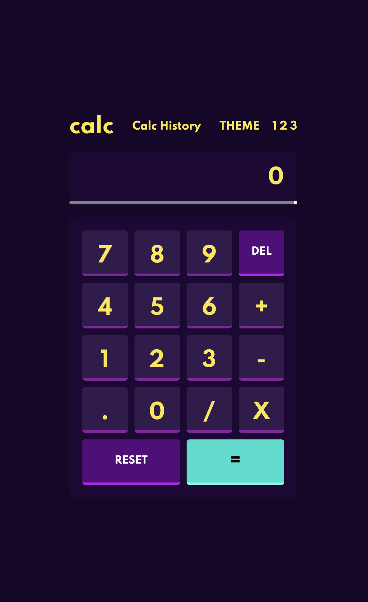

# Frontend Mentor - Calculator app solution

This is a solution to the [Calculator app challenge on Frontend Mentor](https://www.frontendmentor.io/challenges/calculator-app-9lteq5N29). Frontend Mentor challenges help you improve your coding skills by building realistic projects. 

## Table of contents

- [Overview](#overview)
  - [The challenge](#the-challenge)
  - [Screenshot](#screenshot)
  - [Links](#links)
- [My process](#my-process)
  - [Built with](#built-with)
  - [What I learned](#what-i-learned)
  - [Continued development](#continued-development)
  - [Useful resources](#useful-resources)
- [Author](#author)

## Overview

### The challenge

Users should be able to:

- See the size of the elements adjust based on their device's screen size
- Perform mathmatical operations like addition, subtraction, multiplication, and division
- Adjust the color theme based on their preference
- **Bonus**: Have their initial theme preference checked using `prefers-color-scheme` and have any additional changes saved in the browser

### Screenshot




### Links

- Solution URL: [Calculator App](https://calculatorapp-marcel.netlify.app)
- Live Site URL: [Calculator App](https://calculatorapp-marcel.netlify.app)

## My process

### Built with

- Semantic HTML5 markup
- CSS custom properties
- Flexbox
- CSS Grid
- Mobile-first workflow
- React Cookies
- [React](https://reactjs.org/) - JS library

### What I learned

  The JS functions below were lessons I've solidified, I was very intricate and caught all possible errors that could of happen when performing logic in my calculator app it took a lot of Qa testing but I found the small bugs and squashed them!

```js
const proudOfThisFunc = () => {
  if (!result && !operands.includes(calculation.slice(-1))) {
      setResult(eval(calculation));
      setCalculation(eval(calculation));

      setCompletedCalculations(prevVal => [...prevVal, calculation])
  } else if (!result && operands.includes(calculation.slice(-1))) {
      alert('Check Your calculation you evaluated a incomplete sum')
  }
}

const addToValStr = num => {
        if (num === '/' || num === '*' || num === '+' || num === '-' || num === '.'){
            if (calculation.length > 1 && operands.includes(calculation.slice(-1))) {
                return;
            } else {
                setResult(null)
                setCalculation(calculation + num)
            }
        } else {
            setResult(null)
            setCalculation(calculation + num);
        }
    }
```

### Continued development

Moving forward I'll definitely use the lessons I learned when working with browser cookies to save information in react apps as well as the use of recoil and redux as my first version of this app was built using global state control. I will also take with me the valuable lesson I learned on how to work with grids in css and mobile first responsive design.

### Useful resources

- [React Cookies npm](https://www.npmjs.com/package/react-cookie) - This helped me learn how to use cookies in react, I really liked this pattern and will use it going forward!

## Author

- Website - [Marcel Palmer](https://calculatorapp-marcel.netlify.app)
- Frontend Mentor - [@Marcelckp](https://www.frontendmentor.io/profile/Marcelckp)
- Twitter - [@marcelckpalmer](https://www.twitter.com/marcelckpalmer)
